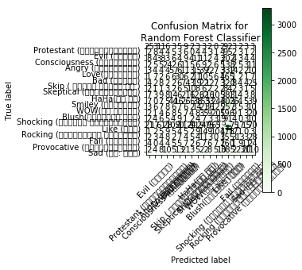
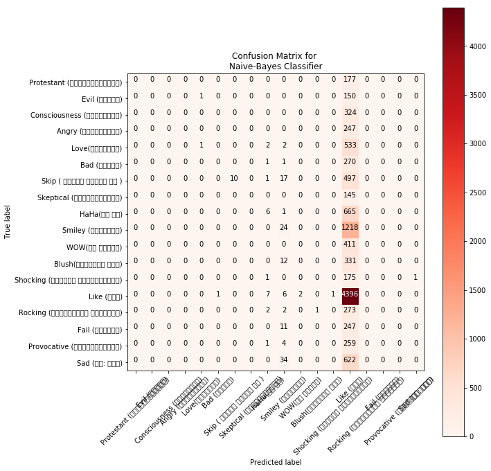
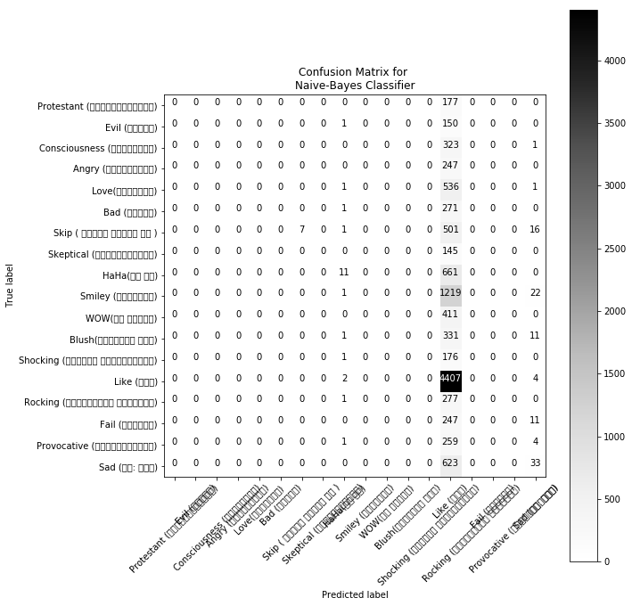

# <center> Dataset -  Senimental Analysis  </center>


```python
from sklearn import datasets
from sklearn import svm
import pandas as pd
from numpy import genfromtxt
# Stemming purposes
from nltk.stem import PorterStemmer
from nltk.stem.snowball import SnowballStemmer
from nltk.tokenize import sent_tokenize, word_tokenize

# Splitting Dataset
from sklearn.model_selection import train_test_split
from sklearn.feature_extraction.text import TfidfVectorizer, CountVectorizer

from sklearn import metrics
import numpy as np
import itertools
#Helper

import matplotlib.pyplot as plt


#PLOT Matrix

def plot_confusion_matrix(cm, classes,
                          normalize=False,
                          title='Confusion matrix',
                          cmap=plt.cm.Blues):
    """
    See full source and example: 
    http://scikit-learn.org/stable/auto_examples/model_selection/plot_confusion_matrix.html
    
    This function prints and plots the confusion matrix.
    Normalization can be applied by setting `normalize=True`.
    """
    plt.imshow(cm, interpolation='nearest', cmap=cmap)
    plt.title(title)
    plt.colorbar()
    tick_marks = np.arange(len(classes))
    plt.xticks(tick_marks, classes, rotation=45)
    plt.yticks(tick_marks, classes)

    if normalize:
        cm = cm.astype('float') / cm.sum(axis=1)[:, np.newaxis]
        print("Normalized confusion matrix")
    else:
        print('')
#         print('Confusion matrix, with little normalization')

    thresh = cm.max() / 2.
    for i, j in itertools.product(range(cm.shape[0]), range(cm.shape[1])):
        plt.text(j, i, cm[i, j],
                 horizontalalignment="center",
                 color="white" if cm[i, j] > thresh else "black")

    plt.tight_layout()
    plt.ylabel('True label')
    plt.xlabel('Predicted label')
    plt.rcParams['figure.figsize'] = [10, 10]
    plt.show()
```

# <center>  Dataset Parse </center>


```python

data_set = pd.read_csv("sentiment.csv", sep=';')


print(data_set.shape)

print(data_set.head())

outputClass = list(set(data_set.label))
print('no of class:')
print(len(outputClass))

print('Output Class:')
print('\n'.join([a for a in outputClass]))

```

    (27731, 2)
                                                    text                     label
    0  রুদ্র জাহেদ ভাই খুব ভাল লাগল আপনার মন্তব্যে অন...             Love(ভালবাসা)
    1  যারা ব্লগ দিয়ে ইন্টারনেট চালানোর দাবি করেছিল ২...                Like (ভাল)
    2                                  থ্যাংকস সুমন ভাই।                Like (ভাল)
    3                                  থ্যাংকস সুমন ভাই।                Like (ভাল)
    4                              সময়ের নিষ্ঠ প্রতিবাদ।  Consciousness (চেতনাবাদ)
    no of class:
    18
    Output Class:
    Protestant (প্রতিবাদমূলক)
    Evil (জঘন্য)
    Consciousness (চেতনাবাদ)
    Angry (রাগান্বিত)
    Love(ভালবাসা)
    Bad (খারাপ)
    Skip ( বোঝতে পারছি না )
    Skeptical (সন্দেহপ্রবণ)
    HaHa(হা হা)
    Smiley (স্মাইলি)
    WOW(কি দারুন)
    Blush(গোলাপী আভা)
    Shocking (অতিশয় বেদনাদায়ক)
    Like (ভাল)
    Rocking (আন্দোলিত হত্তয়া)
    Fail (ব্যর্থ)
    Provocative (উস্কানিমুলক)
    Sad (দু: খিত)


# <center> Stemming Text </center>


```python
# print(data_set.text)

text = data_set.text
verdict = data_set.label
```

# <center>  Splitting Dataset </center>


```python
X_train, X_test, y_train, y_test = train_test_split(text, verdict, test_size=0.4, random_state=53)
print("Dataset Splitted.")
```

    Dataset Splitted.


# <center>  Applying TF-IDF </center>


```python
count_vectorizer = CountVectorizer(stop_words='english')
count_train = count_vectorizer.fit_transform(X_train) 
count_test = count_vectorizer.transform(X_test)

tfidf_vectorizer = TfidfVectorizer(stop_words='english', max_df=0.7) 
tfidf_train = tfidf_vectorizer.fit_transform(X_train) 
tfidf_test = tfidf_vectorizer.transform(X_test)

print("TF-IDF Training Started\n->->->")
# print(tfidf_train)
print("TF-IDF Training Ended")
```

    TF-IDF Training Started
    ->->->
    TF-IDF Training Ended


# <center>  Feature Extract </center>


```python
print('Sample features names\n',tfidf_vectorizer.get_feature_names()[1500:1600:5], '\n')
# print(count_vectorizer.get_feature_names()[900:910])

feature_arr = tfidf_vectorizer.get_feature_names()

for i in range(1500, 1600, 5):
    val = tfidf_vectorizer.vocabulary_[feature_arr[i]]
    print(feature_arr[i] , " ----> " , val)
# print(tfidf_vectorizer)
```

    Sample features names
     ['গঠন', 'গডফ', 'গণত', 'গণম', 'গতকয়', 'গতর', 'গন', 'গনসচ', 'গপৎ', 'গম', 'গরজ', 'গলক', 'গলদও', 'গলময়', 'গহ', 'গড়ন', 'গয়ন', 'ঘটক', 'ঘটব', 'ঘদ'] 
    
    গঠন  ---->  1500
    গডফ  ---->  1505
    গণত  ---->  1510
    গণম  ---->  1515
    গতকয়  ---->  1520
    গতর  ---->  1525
    গন  ---->  1530
    গনসচ  ---->  1535
    গপৎ  ---->  1540
    গম  ---->  1545
    গরজ  ---->  1550
    গলক  ---->  1555
    গলদও  ---->  1560
    গলময়  ---->  1565
    গহ  ---->  1570
    গড়ন  ---->  1575
    গয়ন  ---->  1580
    ঘটক  ---->  1585
    ঘটব  ---->  1590
    ঘদ  ---->  1595


```python
tfidf_df = pd.DataFrame(tfidf_train.A, columns=tfidf_vectorizer.get_feature_names())
# print(tfidf_df.tail())
```

# <center> Random Forest Classifier </center>


```python
from sklearn.ensemble import RandomForestClassifier

clf_rand = RandomForestClassifier(n_estimators = 26 , criterion = 'entropy' , random_state = 0)

clf_rand.fit(tfidf_train, y_train)

pred_rand = clf_rand.predict(tfidf_test)

score = metrics.accuracy_score(y_test, pred_rand)

print("Accuracy:   %0.2f" % (score*100.) + "%")
cm = metrics.confusion_matrix(y_test, pred_rand, labels=outputClass)
plot_confusion_matrix(cm, 
                      classes=outputClass, 
                      title="Confusion Matrix for \nRandom Forest Classifier",
                      cmap = plt.cm.Greens
                     )
```

    Accuracy:   36.66%
    





# <center> Naive Bayes </center>


```python
from sklearn.naive_bayes import MultinomialNB
import itertools

naive_classifier = MultinomialNB()
naive_classifier.fit(tfidf_train, y_train)
pred_tree = naive_classifier.predict(tfidf_test)

score = metrics.accuracy_score(y_test, pred_tree)
print("Accuracy:   %0.2f" % (score*100.) + "%")
cm = metrics.confusion_matrix(y_test, pred_tree, labels=outputClass)
plot_confusion_matrix(cm, 
                      classes=outputClass, 
                      title="Confusion Matrix for \nNaive-Bayes Classifier",
                      cmap = plt.cm.Reds
                     )
```

    Accuracy:   40.00%
    





# <center>  SVM Classifier </center>


```python
from sklearn import svm

clf_svm = svm.SVC(probability=True, C=1000)

clf_svm.fit(tfidf_train, y_train)
pred_svm = clf_svm.predict(tfidf_test)
score = metrics.accuracy_score(y_test, pred_svm)
print("Accuracy:   %0.2f" % (score*100.) + "%")
cm = metrics.confusion_matrix(y_test, pred_svm, labels=outputClass)
plot_confusion_matrix(cm, 
                      classes=outputClass, 
                      title="Confusion Matrix for \nNaive-Bayes Classifier",
                      cmap = plt.cm.Greys
                     )
```

    Accuracy:   40.19%
    




